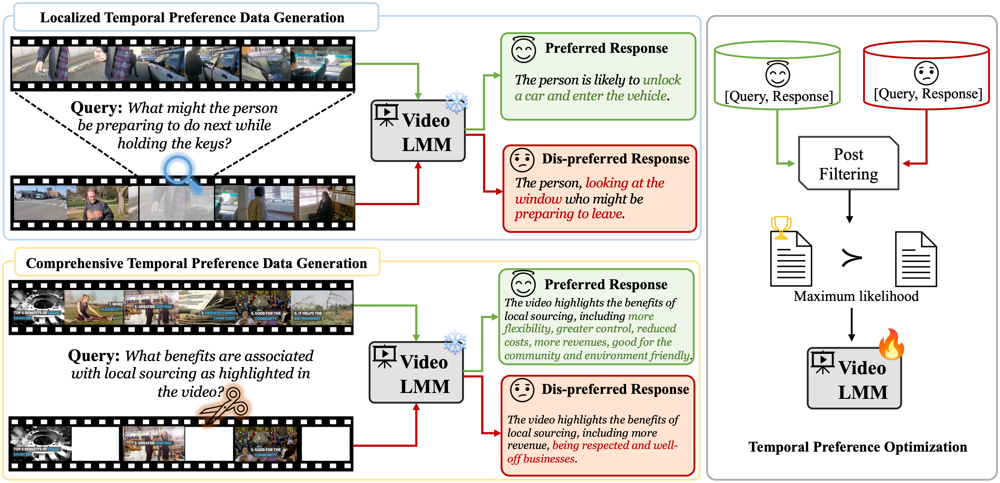

# Temporal Preference Optimization (TPO) for Long-form Video Understanding

<a href='https://arxiv.org/abs/2410.17434'></a> <a href='https://vision-cair.github.io/LongVU'></a> <a href='https://huggingface.co/spaces/Vision-CAIR/LongVU'></a> <a href='https://huggingface.co/collections/Vision-CAIR/longvu-67181d2debabfc1eb050c21d'></a> 


</img>
Our work propose Temporal Preference Optimization (TPO), which serves as comprehensive pipeline for self-training based temporal preference optimization for cutting-edge video large multimodal models (video-LMMs). TPO enhances video comprehension in video-LMMs by modeling temporal preferences at two granular levels: localized and comprehensive TPO. In localized TPO (upper-left), we generate queries focused on short segments, with contrastive responses that retain or exclude the target segment. For comprehensive TPO (lower-left),  queries are designed broader understanding, using intact video versus sparse downsampled video for contrasting responses. After post-filtering, the contrast response pairs are serving as the  preference dataset to train a video-LMM, guiding the model to prioritize preferred responses for improved video understanding.


## :rocket: Quick Start

### Linux
For evaluation on LongVA:
```
git clone https://github.com/ruili33/TPO
cd TPO
conda create -n TPOLongVA python=3.10
pip install torch==2.1.2 torchvision --index-url https://download.pytorch.org/whl/cu118
pip install -e "longva/.[train]"
pip install packaging &&  pip install ninja && pip install flash-attn==2.5.0 --no-build-isolation --no-cache-dir
pip install -r requirements_longva.txt
```

For evaluation on LLaVA-Video: